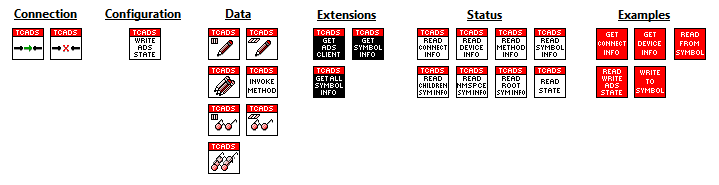
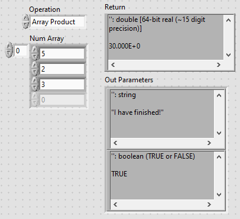
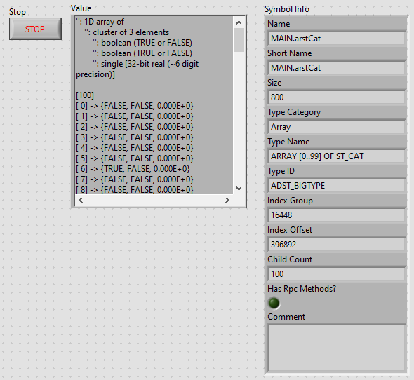
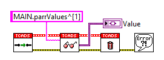
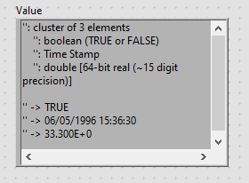
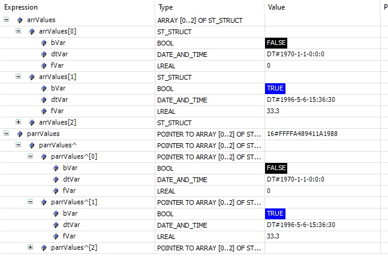

# LabVIEW TwinCAT ADS

[](https://www.vipm.io/package/fisothemes_lib_labview_twincat_ads/) [](https://www.vipm.io/package/fisothemes_lib_labview_twincat_ads/)

Easy to use Unofficial LabVIEW TwinCAT API for communicating with Beckhoff PLCs via ADS. Features include Invoking Rpc Methods, Reading/Writing of PLC variables (including all Standard types, Pointers, References, Time, Strings, WStrings, Structs composed of the aforementioned, Nested STRUCTs and Multi-dimensional Arrays of the aforementioned datatypes), introspective capabilities (get the symbol and type information), the ability to build your own low-level VIs via Extensions and more. 


# Minimum Requirements
* LabVIEW 2018 (32/64 bit) and above
* .NET Framework 4.6.2 (installed by default with LabVIEW)
* TwinCAT 3.1.4024.10 and above (haven't tested below 4024.10 might work with lower versions)


# Changelog
Notes:
------
+ Preparation for VIMP.io release.
+ To read and write to pointers simply add the dereferencing symbol to your symbol name e.g. `"pValue^"`.
+ References are read like normal symbols.

New Features:
-------------
+ Support for reading and writing to `POINTER`s and `REFERENCE`s.
+ Support for reading and writing `FUNCTION BLOCK`s as clusters.
+ Added VIs for reading and writing data as bytes.
+ Added VI for reading symbol attributes e.g. `{attribute 'answer to everything' := '42'}`.
+ Added VI for reading all namespaces.
+ Added high-speed reading example.

Fixes:
------
+ Fixed the issue in which you couldn't read aliases of `STRUCT`s
+ Fixed .NET reference leaks in the `Read Method Information` VI

# Showcase
VIs included in the API:



# Examples
Invoke Method:
-





Event-Driven Reading:
-




Write Symbol:
-


Read Symbol:
-


Pointer Support:
-






High-Speed Reading:
-


# Developer Notes

Connection
----------
1. You may notice that the `Connect.vi` is slow in connection. This is normal.
    The VI is simply caching the symbols and types in LabVIEW rather than keeping them in a .NET collection. The reason for this is that lookup times on the .NET Ads-XYZ-Collection are very slow. The further I moved away from making calls to any of Beckhoff's .NET libraries the faster operations became. The penalty for doing this is a slow connection.

2. Because of the caching system, online changes are currently not supported.

3. You do not need to disconnect before disposal. `Dispose.vi` VI will disconnect for you.

Read, Write and Invoke Method
---------------------------------

1. Operations involving `UNION`s types are not yet supported.

2. To read and write to pointers simply add the dereferencing symbol to your symbol name e.g. `pValue^`.

3. First calls to an operation (Reading/Writing a symbol or Invoking a Method) will be slow.

    Typical first call times for my RYZEN 3600X system with 1 isolated core are ~5ms for `ARRAY[0..999] OF LREAL` and ~40ms for `ARRAY[0..999] OF ST_STRUCT` where `ST_STRUCT` is:
    ```pascal
    TYPE ST_STRUCT :
    STRUCT
        bVar  : BOOL;
        dtVar : DT;
        fVar  : LREAL;
    END_STRUCT
    END_TYPE
    ```
    Subsequent calls resulted in read/write/method invoking times of 1-2ms for `ARRAY[0..999] OF LREAL` and ~20ms for `ARRAY[0..999] OF ST_STRUCT`. The task cycle time was 1ms.

4. When sending numbers, arrays of numbers or structs with numbers, enums, etc. The numbers will be coerced to the type defined in the PLC for that variable/parameter. This is by design. LabVIEW is a graphical language so switching between Single Precision Float and Doubles is an absolute pain. There are no aliases in LabVIEW.

5. LabVIEW Arrays don't need to be the same size as the PLC arrays to write them. Write what you need, the rest will be filled in with defaults.


Events
------

1. Online change is not supported. However, you can update variables on the PLC without needing to disconnect on the LabVIEW side via `Login with Download`, `Restart TwinCAT System` and `Activate TwinCAT Configuration`. All symbols will automatically be reloaded into memory.

    *NOTE: Any reads or writes running during this process will produce errors, just ignore these errors until reconnection is complete. They will stop once that happens.*

2. Don't forget to close the Registration Refnum after you're done. User Events references are automatically closed on disposal.

Other
------
1. When using extensions. Please only close the .NET references with an asterisk (*) on their label at the connector pane. The ones without an * are managed for you.

**Please feel free to contribute to the project or report bugs**
- - - -
