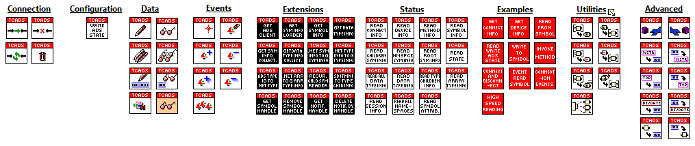

# LabVIEW TwinCAT ADS
Unoffcial LabVIEW TwinCAT API for communicating with Beckhoff PLCs via ADS. Features include Invoking Rpc Methods, transfer of STRUCTs, Nested STRUCTs and Arrays of nested STRUCTS and ability to build your own VIs via Extensions. 

# Minimum Requirements
* LabVIEW 2018 (32/64 bit)
* OpenG
* .NET Core 3.1

# Showcase
These are the VIs included in the API

# Examples

 **Writing to Symbol:**

 **Reading from Symbol:**

# Developer Notes

* **Write and Read Fast**

If you need sub 100ms read/write speeds you will need to used the Write Fast and Read Fast VIs. 
However these come with caveats.

1. All Strings must have a size of 256 byte e.g. `STRING(255)` or `T_MaxString` 

2. The pragma `{attribute 'pack_mode' := '1'}` must be included in all STRUCTS you wish to access

3. Have a computer that can handle it!

* **Invoking Methods**

Current Invoking methods only supports primitive types and arrays of primitive types. Will look into STRUCT support after I finish adding events...speaking of events!

* **Events**

There is already boiler plate code for events in the API. Currently working on that. Will hopefully add next update

**Please feel free to contribute to the project or report bugs**
- - - -
